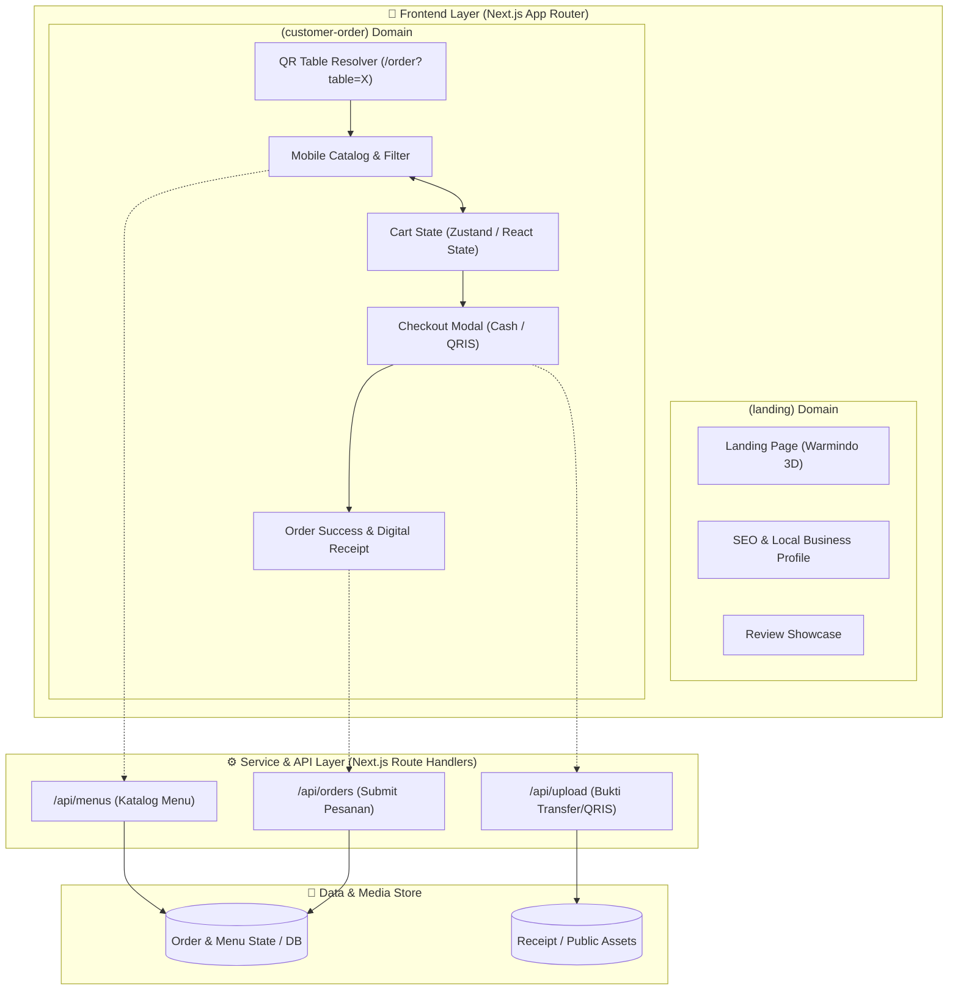
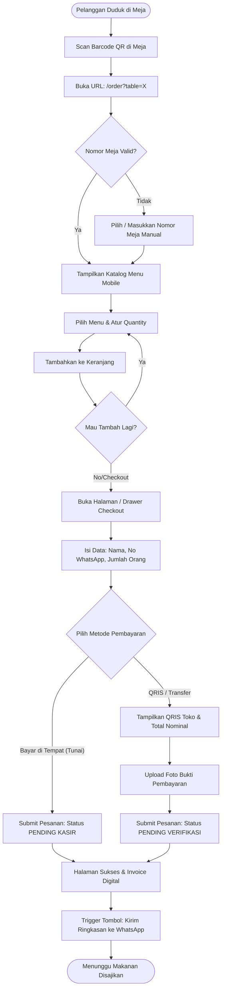
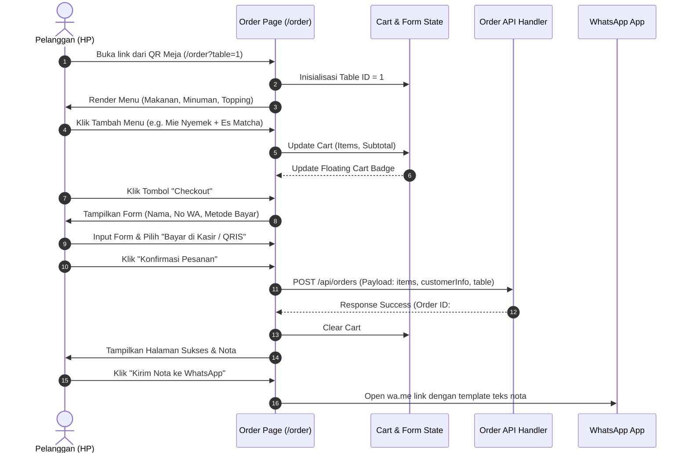

# 🏗️ SYSTEM ARCHITECTURE & FLOW DIAGRAMS — SPRINT 1

Dokumen ini berisi diagram alur dan arsitektur sistem berbasis **Mermaid Syntax**. Anda dapat menyalin (*copy-paste*) kode diagram di bawah ke tools online seperti:
- 👉 [Mermaid Live Editor](https://mermaid.live/)
- 👉 [Eraser.io](https://www.eraser.io/)
- 👉 GitHub / Notion Markdown Viewer

---

## 1. High-Level System Architecture

Diagram ini menunjukkan pembagian modul antara Landing Page, Modul Self-Order Pelanggan, dan Backend/State.

---

## 2. Customer Order Flowchart (End-to-End User Journey)

Alur lengkap langkah demi langkah dari saat pelanggan duduk di meja sampai pesanan terkirim:

---

## 3. Sequence Diagram (Interaksi Komponen & State)

Menunjukkan bagaimana data mengalir antara Browser Pelanggan, Frontend Component, dan Backend State:

