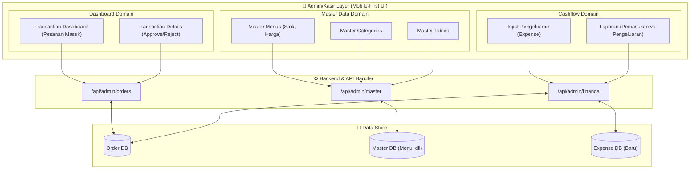
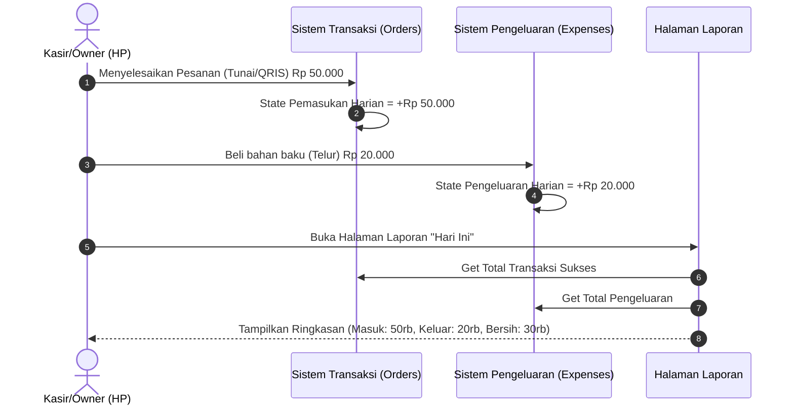

# 🏗️ SYSTEM ARCHITECTURE & FLOW DIAGRAMS — SPRINT 2

Dokumen ini berisi diagram alur dan arsitektur sistem berbasis **Mermaid Syntax** khusus untuk modul Admin/Kasir (Sprint 2).

---

## 1. High-Level Admin Architecture

Diagram ini menunjukkan bagaimana Dashboard Admin terhubung dengan entitas data yang telah dibuat pada Sprint 1, serta penambahan modul Pengeluaran (Expense).



---

## 2. Cashier Transaction Flowchart (Order Handling)

Alur Kasir dalam menangani pesanan yang masuk dari pelanggan:

```mermaid
flowchart TD
    Start([Notifikasi / Pesanan Masuk]) --> CheckDash[Buka Dashboard Transaksi]
    CheckDash --> ViewList[Lihat List Pesanan (Status: NEW / PENDING)]
    
    ViewList --> ClickDetail[Klik Detail Pesanan Tertentu]
    ClickDetail --> CheckPayment{Metode Pembayaran?}
    
    CheckPayment -- Tunai (Cash) --> WaitCash[Tunggu Pelanggan Bayar ke Kasir]
    WaitCash --> ConfirmCash[Konfirmasi Pembayaran Diterima]
    
    CheckPayment -- QRIS / Transfer --> CheckProof[Lihat Foto Bukti Transfer]
    CheckProof --> VerifyBank{Cek Mutasi Rekening}
    VerifyBank -- Belum Masuk --> Reject[Tandai Belum Lunas / Tolak]
    VerifyBank -- Sudah Masuk --> ConfirmCash
    
    ConfirmCash --> ProcessOrder[Tandai Pesanan "Sedang Dimasak"]
    ProcessOrder --> ServeOrder[Pesanan Disajikan ke Meja]
    ServeOrder --> Finish([Tandai Pesanan "SELESAI"])
```

---

## 3. Simple Cashflow Diagram (Pemasukan vs Pengeluaran)

Alur bagaimana sistem menghitung Laporan Laba Kotor harian untuk Owner:


